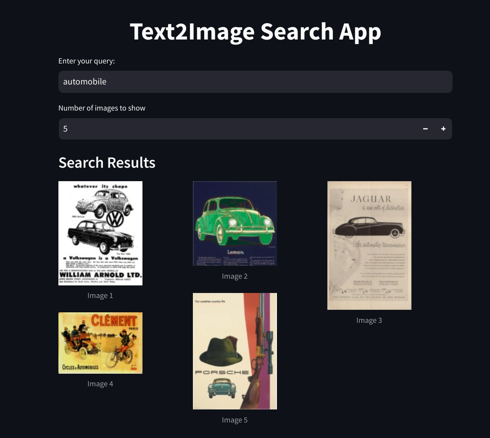

# Text2Image Search 
Welcome to the Text2Image Search Implementation project! 
## Architecture
The Text2Image search implementation follows the following architecture:

* CLIP (Contrastive Language-Image Pre-Training) Model:

    Utilizes the CLIP model to generate image and query (text) embeddings.
* Qdrant Vector Search:

    Implements Qdrant vector search for efficient retrieval of relevant images based on embeddings.
* Streamlit Application:

    Serves the entire system with a Streamlit application, providing an interactive interface for users to perform text-to-image searches.

## Dataset 
The dataset used for this project comprises advertisement images. This dataset includes advertisements from various countries and in various languages. The total dataset size is 11106. An exploratory evaluation of the dataset has been conducted in the `data_exploration.ipynb` script.

## Installation
* Clone the repository

    ```
    git clone https://github.com/khalidA16/Text2ImageSearch.git
    cd Text2ImageSearch/
    ```
* Run the following command to set up the virtual environment and install dependencies listed in `requirements.txt`, as well as download the image dataset to the `image_dataset` directory:

    ```
    source setup.sh
    ```
## Run 
#### Start Qdrant 
* Pull qdrant docker image 

    ```
    docker pull qdrant/qdrant
    ```
* Run qdrant 

    ```
    docker run -d -p 6333:6333 qdrant/qdrant
     ```
     `-d` to run container in detached mode
* Optional: Access qdrant through Web UI at  http://0.0.0.0:6333/dashboard

#### Run Text2Image Search Implementation
* To use the Text2Image Search Implementation, run the following command:

    ```
    python main.py 
    ```
    To use saved image embeddings instead of generating, run:

    ```
    python main.py --load
    ```

#### Streamlit App Interface
The search system uses a steamlit application to interact and display results.

* Under 'Enter your query', type the query to search results for.

* No. of images to display for your query can be adjusted in 'Number of images to show'. (Min 1 and Max 10 images).

* Images related to the query will be displayed under ' Search Results'




## Scripts Overview
* `embedder.py`: Contains the `Embedder` class, which generates image and text embeddings using the CLIP model.
* `qdrant_client_upload.py`: Contains the `UploadQdrant` class, responsible for creating a collection of the image embeddings and uploading it to Qdrant.
* `app.py`: This script is the Streamlit app script, which serves as the frontend for interacting with the Text2Image Search system.
* `main.py`: This script orchestrates the execution of the above scripts.

## Query Evaluation
The results of query evaluations on the Text2Image Search implementation can be found in the `query_eval/query_evaluation.md` file. This document provides insights into the performance of the search system across various query types and scenarios.

## Additional Improvements
while the implemented Streamlit app interface prioritizes simplicity, there remains room for enhancing the user experience to ensure higher quality interactions.