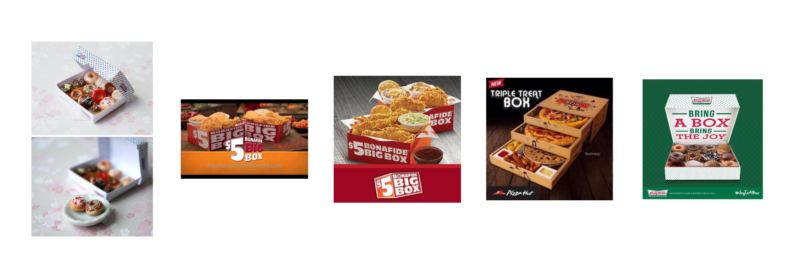
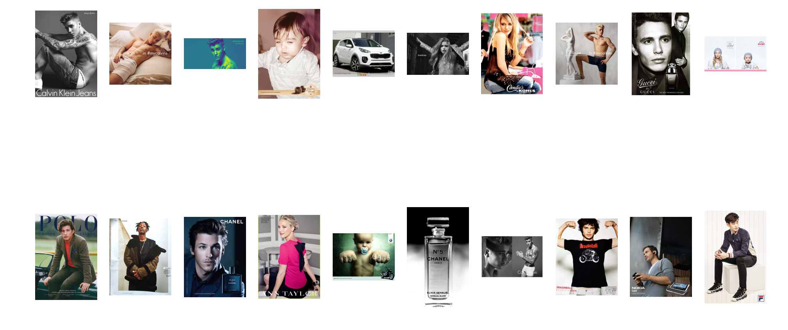
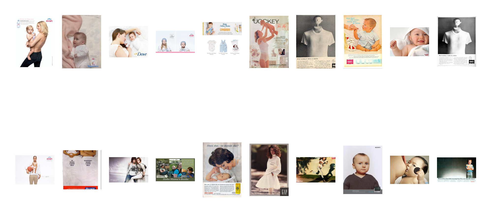
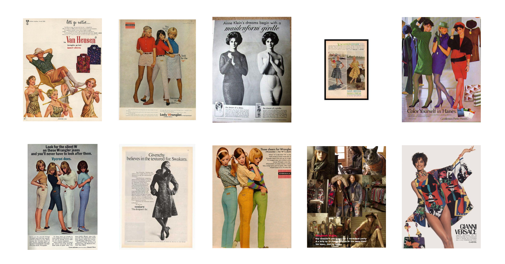
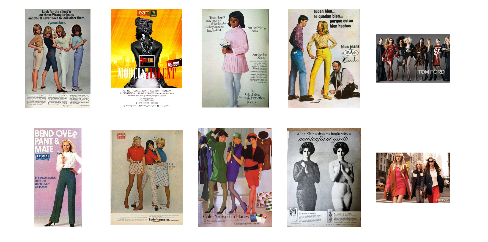

## Query Evaluation

### Successful Queries
The implemented search system was tested on different levels of queries:
* Easy Queries:
    Single-word queries
    * Statues 
    
    *Top 5 hits*
* Medium Queries:
    Slightly descriptive queries
    * Food in a box
      
      *Top 5 hits*
* Hard Queries:
    More descriptive queries
    * Red haired woman with red lips and blue eyes on a magazine cover
    
    *Top 5 hits*
    
    
### Unsuccessful Queries
During the evaluation of the Text2Image search system, some interesting discrepancies in search results were observed. These examples highlight instances where the system's performance did not meet expectations. 

#### Example # 1
* Single Word Query: 'baby'

    For the query 'baby', the search system retrieved diverse results, including images of Justin Bieber and with irrelevant contexts. Within the top 20 results, only three depicted actual babies.
    
    
*Top 20 hits*

    The prominence of Justin Bieber images can be attributed to the system's tendency to extract broad contexts (Here because of his song 'Baby' ) and interpolate meanings beyond the literal interpretation of the word 'baby'.

* Descriptive Query: 'baby wearing white t-shirt'

    In contrast, the more descriptive query yielded significantly more relevant images. The system prioritized images closely matching the query context.

*Top 20 hits*

#### Example # 2
* 'vintage fashion more than one ladies'

When searching for 'vintage fashion more than one ladies' the system yielded accurate results. 

*Top 10 hits*
 
 * 'fashion more than one ladies'

 However, simplifying the query to 'fashion more than one ladies' resulted in less accuracy with three inaccurate images in the top five.

 Simplifying the query broadened the search scope, potentially causing the system to prioritize broader contexts such as 'fashion' and 'ladies' without accurately considering the 'more than one' criteria. Conversely, by adding the term 'vintage,' the search scope became more specific, enabling the system to focus on a narrower set of results that better aligned with the specified criteria. This highlights the importance of query specificity in guiding the search process and emphasizes the impact of query formulation on the accuracy and relevance of search results.

 

*Top 10 hits*
 
#### Example # 3:
In the thrid case, a German word 'sicherheit' was used as a query which did not relate to the dataset. Surprisingly, the system was able to retrieve pictures that either contained German text or were related to Germany (Porsche).

* Top 5 hits*

This observation supports our earlier findings, that system appeared to prioritize contextual understanding for short queries. 

Overall, it suggests that the system's performance may vary depending on the complexity and specificity of the query. As queries become more descriptive, the system may exhibit a tendency to focus more on specific keywords. Where as if the query is very simple, then the system may find broad contextual meanings resulting in inaccurate findings.

## Method of Quantitative Evaluation of Retrieval Accuracy and Improvements:

Following things can be considered during quantitative evaluations:

* Data Labelling:

    Ensure accurate labelling and adding detailed meta-data of each image with details like brand names, product categories, objects in the scene, scenario, weather etc.

* Query Preparation:

    Instead of relying solely on predefined queries, consider incorporating user inputs to generate queries dynamically. This approach can mimic real-world search scenarios more accurately and provide insights into user intent that may not be captured by static queries. Additionally, these queries can be filtered to address potential challenges stemming from ambiguity or noise in user input.
   

* Evaluation Metrics:

   Besides traditional metrics like Precision and Recall, incorporate user feedback on result relevance to continuously improve relevance judgment based on user interactions. Moreover, introducing additional metrics like accuracy at_1 and at_K, which evaluate the system's accuracy in generating different numbers of images in search results, is highly beneficial. Evaluating accuracy across different result sizes offers nuanced insights into the system's performance, revealing challenges and opportunities for enhancing result quality across diverse output quantities.